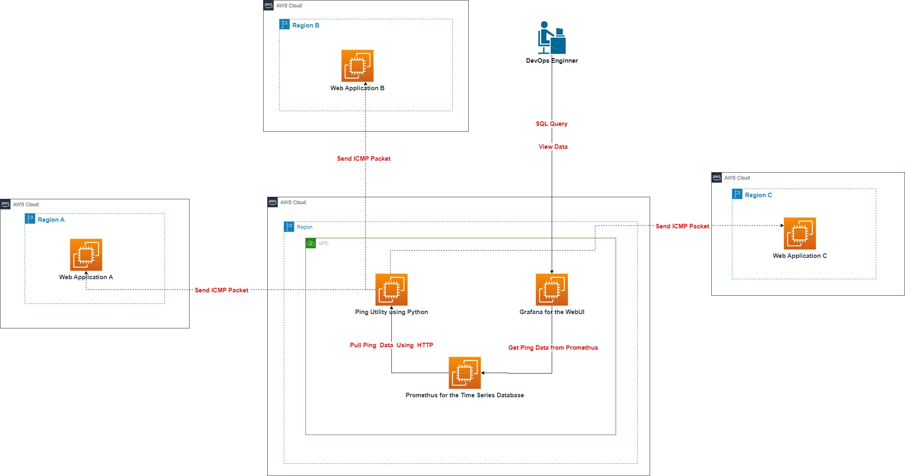

# Synthetic Monitoring Platform

The Synthetic Monitoring Platform is a comprehensive solution designed to monitor network and application performance using synthetic transactions. It leverages Python, Prometheus for time series database management, and Grafana for insightful visualizations. This platform utilizes the PingParsing library to perform efficient ping operations, ensuring high availability and performance of your services.

## Features

- **Ping Monitoring**: Utilizes the PingParsing library for accurate and detailed ICMP echo request analyses.
- **Time Series Data Storage**: Integrates with Prometheus for efficient storage, retrieval, and analysis of monitoring data over time.
- **Visual Insights**: Employs Grafana for customizable and insightful visualization of monitoring data, aiding in quick decision-making.
- **Configurable Monitoring**: Supports customization and configuration for different environments and requirements.

## System Design Diagram



## Getting Started

These instructions will get you a copy of the project up and running on your local machine for development and testing purposes.

### Prerequisites

Before you begin, ensure you have the following installed:
- Python 3.6 or later
- pip (Python package manager)

### Installation

1. Clone the repository to your local machine:

```bash
git clone https://github.com/ELF-Conan/synthetic-monitoring-platform.git
```

2. Navigate to the project directory:

```bash
cd synthetic-monitoring-platform
```

3. Install the required Python packages:

```bash
pip install -r requirements.txt
```

### Configuration
1. (Optional) Configure Prometheus and Grafana according to your environment.
2. To configure the monitoring targets and behavior of the platform, edit the monitoring_config.yml file located in the root directory. Here are the available configuration options:

- **`ping_targets`**:A list of targets to be monitored with ping. Each target has the following properties:
  - **`host`***: The hostname or IP address of the target.
  - **`duration`***: The number of ping packets to send to each target during each check.

- **`http_port`**:The port on which the Prometheus metrics exporter will run. This port is used by Prometheus to scrape the metrics exposed by this platform.

- **`ping_interval`**:The interval, in seconds, at which the platform will perform ping checks against all specified targets.

3. For advanced configurations, refer to the individual documentation for Prometheus and Grafana.


### Running
To start the Synthetic Monitoring Platform via Python command:
```bash
python3 synthetic_monitoring/main.py
```

To start the Synthetic Monitoring Platform via Shell command in Linux System:
```bash
cd synthetic-monitoring-platform/scripts
sh start_ping_monitoring.sh
```

### Usage
After starting the platform, it will begin monitoring according to the configurations set. Results can be viewed in Grafana, where dashboards can be customized to display the desired metrics.

